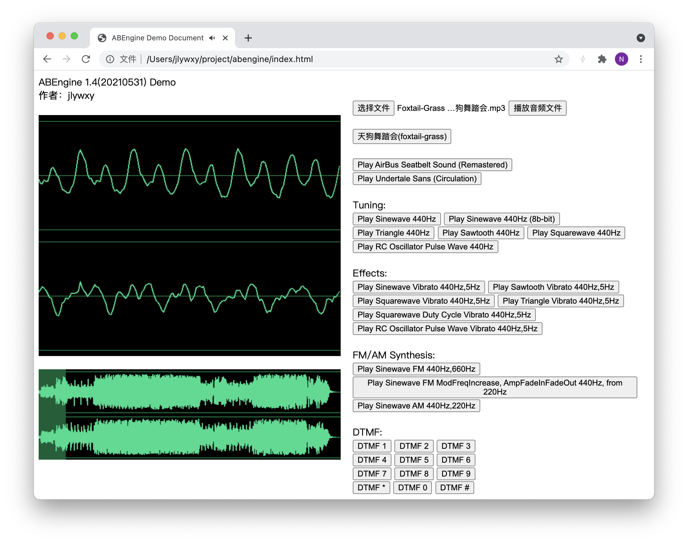

# ABEngine

实时的8bit风格/chiptune音乐合成器，包含音频可视化功能。 <b>基于原生Javascript。</b>(使用Web AudioContext API)  
AB=Eight Bit  
演示网址: https://jlywxy.top/dev/abengine/ 
演示视频: https://www.bilibili.com/video/BV1g5411N7D6  
当前版本: 1.4 (20210531) 
作者: jlywxy (jlywxy@outlook.com)  

## Demo
直接打开index.html

测试部分：
1. 播放并可视化常用的音频文件格式（mp3,wav等等）。
2. 播放预定义的8bit/chiptune序列（天狗舞踏会、Sans）。
3. 测试合成A4音符(440Hz)下的各个乐器（正弦波、三角波、锯齿波、脉冲波、方波）和颤音、渐入渐出效果。
4. 测试合成FM/AM调制。
5. 测试合成电话DTMF音。

